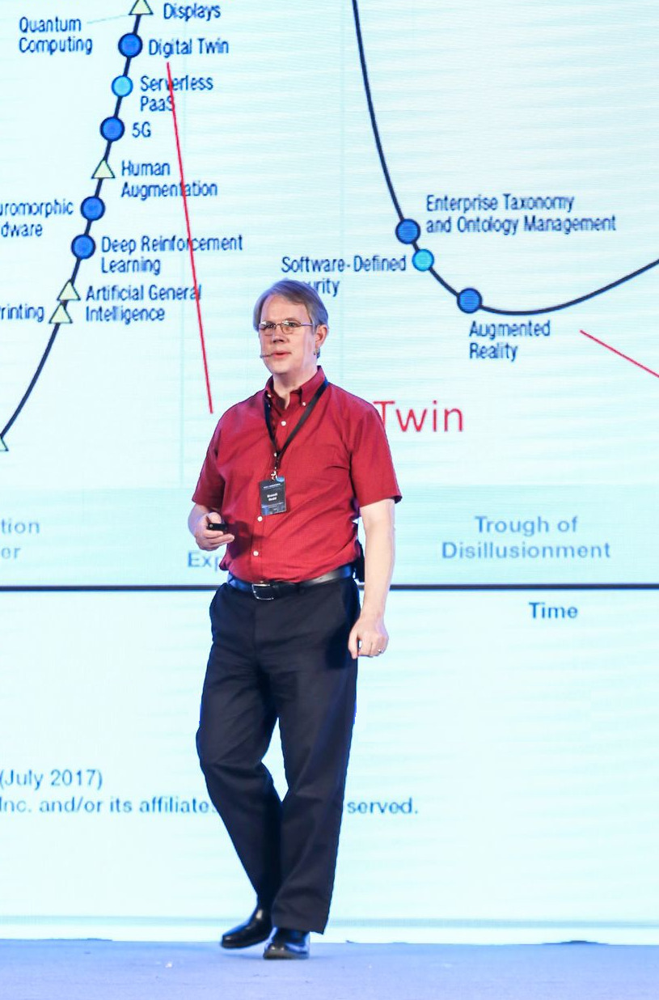

Brandt Redd is an expert in the application of Information Technology to support learning, discovery, and research. In the education and training fields he seeks to apply principles of [personalized learning](http://www.ofthat.com/2013/03/theories-of-education-reform.html) to improve achievement for all students.

# Current Efforts

<a href="https://matchmakeredlabs.net">CTO, MatchMaker Education Labs</a> 
<a href="https://www.edmatrix.org/matrix.html">EdMatrix Creator and Coordinator</a> 
<a href="https://sagroups.ieee.org/ltsc/">Secretary, IEEE Learning Technology Standards Committee</a> 
<a href="https://www.filemeta.org">FileMeta Project</a>

# Find Brandt on the Web

<a href="https://www.linkedin.com/in/brandtredd">LinkedIn</a> 
<a href="http://www.ofthat.com">OfThat Blog</a>, Education, Technology, Energy, and Trust 
<a href="http://www.edmatrix.org">EdMatrix Directory of Learning Technology Standards</a> 
<a href="https://github.com/bredd">GitHub</a> 
<a href="https://twitter.com/brandtredd">Twitter</a> 
<a href="http://bollard.brandtredd.com">Brandt's Bollard Blog</a>

# Select Career Achievements
 * Directed the development and deployment of the [SmarterApp](http://www.smarterapp.org) suite of open source student assessment technology for the [Smarter Balanced Assessment Consortium](http://www.smarterbalanced.org).
 * Co-Conceived and launched the [Learning Resource Metadata Initiative](http://www.lrmi.net/) funded by the [Bill & Melinda Gates Foundation](https://www.gatesfoundation.org/).
 * Developed the [Personalized Learning Model](http://www.ofthat.com/2011/10/personalized-learning-model.html) to guide the educational technology strategy for the [Bill & Melinda Gates Foundation](https://www.gatesfoundation.org/).
 * Created an effective and simple IT Operations strategy for the [Buzz Learning System](https://agilix.com/) at Agilix Labs.
 * Achieved three patents and developed the intellectual property strategy for [Ancestry.com](http://www.ancestry.com).
 * Co-invented the search algorithm for Folio Views (now known as [Rocket Folio](http://folio.com)) at [Folio Corporation](https://en.wikipedia.org/wiki/Folio_Corporation).
 * Co-Founded two successful companies - [Folio Corporation](https://en.wikipedia.org/wiki/Folio_Corporation) and [Agilix Labs](https://agilix.com/).

# Professional Specialties

 * Learning Technology Strategy
 * Assessment Science and Technology
 * Metadata and Data Modeling
 * Learning Data Formats and Protocols
 * Information Technology and Software Engineering
 * Data Security and Cryptography
 * Information Search and Retrieval
 * Business Process Automation

# Education
 * *BS*, Computer Science, Brigham Young University, 1990
 * *MBA*, Emphasis: Organizational Communication, Brigham Young University, 1994

# Key Roles
 * 2019-Present: CTO [MatchMaker Education Labs](https://matchmakeredlabs.net/) 
 * 2013-2018: Chief Information Officer/CTO, [Smarter Balanced Assessment Consortium](http://www.smarterbalanced.org)
 * 2010-2013: Senior Technology Officer - US Education Program, [Bill & Melinda Gates Foundation](https://www.gatesfoundation.org/)
 * 2001-2010: Co-Founder and Chief Technology Officer, [Agilix Labs, Inc.](http://www.agilix.com)
 * 1998-2001: Chief Scientist, [Ancestry.com](http://www.ancestry.com)
 * 1996-1998: Sr. Director, Advanced Technology, Open Market Inc.
 * 1986-1996: Co-Founder and Core Developer, [Folio Corporation](https://en.wikipedia.org/wiki/Folio_Corporation)

# Patents
 * US 20040059864 Systems and Methods for Storing and Retrieving data in a web server environment
 * US 20040059757 Systems and Methods for Partitioning Data on Multiple Servers
 * US 8019719 Systems and Methods for Partitioning Data on Multiple Servers

# Favorite Things
Family, Learning, Mountains, Skiing, Programming, Photography, Hiking, Engineering, Disney, Beaches, Chocolate, Lakes, Reading, Cycling, Church, Snow, Travel, Electronics, Legos, Dogs, Games, Trees, Aircraft, Dance, Bollards, Trust.