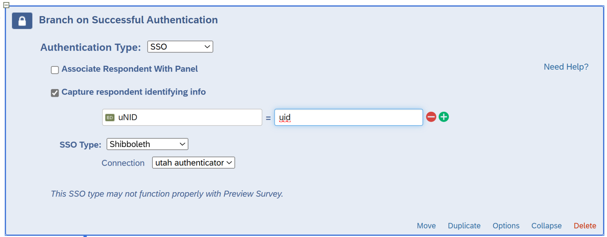

## Capturing the Login ID

If you require an SSO login, you can capture a user's login ID.

First you have to require login. Here are the steps:

1. Select the Survey Flow icon on the left (second one down)
2. Add a new element at the bottom where it says "Add a New Element Here"
3. Select `Authenticator` for the type of element to add.
4. Set `Authentication Type` to "SSO"
5. Uncheck `Associate Respondent With Panel`. If you leave that checked you will get errors.
6. Set `SSO Type` to "Shibboleth"
7. In the `Connection` dropdown, select the name of your SSO service. For example, at the University of Utah it's "utah authenticator"
8. Click `move` at the bottom and drag the block to the very top so that `Branch on Successful Authentication` is the first block in the Survey Flow.

(See the image below for what it should look like.)

With that part in place, it will now require that users log in with University SSO credentials before they can take the survey. The login won't happen on previews, only on the published survey.

Now, you need to configure the survey to record the participant's UID (University ID).

1. In the "Branch On Successful Authentication" block select `Capture respondent identifying info.`
2. Click `Add Embedded Data`
3. Set `Embedded Data To Set` to a variable name you want to represent the participant's ID number. I used "uNID" but you can set it to any value you want.
4. Set `Field from SSO` to the value that your SSO uses to transmit the UID or other information you seek. This varies according to your university or SSO provider. You may have to experiment because not all of these will work. You can also web search for "Qualtrics Embedded Data To Set" to find tips from different organizations. Here are some likely choices:
    * `uid` : At the University of Utah and many universities this will provide the university ID.
    * `urn:oid:1.3.6.1.4.1.5923.1.1.1.6` : This alternative will deliver the user ID or university ID at many organizations.
    * `urn:oid:0.9.2342.19200300.100.1.3` : Email address
    * `urn:oid:2.16.840.1.113730.3.1.241` : Full name
    * `urn:oid:2.5.4.4` : Last name
    * `urn:oid:2.5.4.42` : First name
    * `urn:oid:1.3.6.1.4.1.5923.1.1.1.9` : User role or affiliation
    * 
5. Click `Apply` in the lower-right to save changes.

Here is an screenshot of what the block should look like.

That's all you need to capture the information. When it comes time to analyze and export the results, (in the Data & Analysis tab) the user ID will appear under "Embedded Data > uNID" or whatever name you gave to the variable.

## Suppress Paste

## Timers

## Conditional Display of Questions

## Variable Naming

## Recode Variables and Values

## Requirements
* Force Response
* Request Response

## Randomization
* Random blocks

## Inserted Text

## Likert
* Repeating Scales

## Random Code

## Standard Questions
* Commitment Questions
* Commitment Review (at end)

## Attention Checks

## Progress Bars

## Bot Checks

## Review